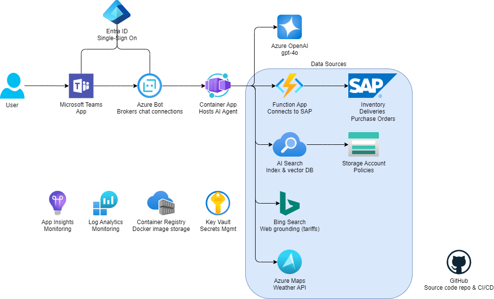

# mfg-sap-ai-agent

This repo is an example of a Microsoft 365 Agent that can be used to interact with SAP systems. It is built using the Microsoft AI Agent framework and is designed to be deployed in M365 Copilot Chat & Microsoft Teams. The agent can be used to query SAP data, correlate with external data sources (such as Bing for getting recent tariff information & Azure Maps for weather information).

## Architecture



## Prerequisites

- [Azure CLI](https://learn.microsoft.com/en-us/cli/azure/install-azure-cli?view=azure-cli-latest)
- [Visual Studio 2022](https://visualstudio.microsoft.com/vs/)
- [Microsoft Teams](https://www.microsoft.com/en-us/microsoft-teams/download-app)
- [Azure Dev Tunnel](https://learn.microsoft.com/en-us/azure/developer/dev-tunnels/get-started?tabs=windows)

## Deployment instructions

1.  Create [Entra ID app registration & service principal](https://learn.microsoft.com/en-us/azure/bot-service/bot-service-quickstart-registration?view=azure-bot-service-4.0&tabs=userassigned)

    1.  Copy the `Tenant ID` and `Application (client) ID` to Notepad.

    ### Authentication blade
    
    1.  Set `Web` Redirect URI to `https://token.botframework.com/.auth/web/redirect`

    1.  Set `Who can use this application or access this API` to `Accounts in any organizational directory (Any Microsoft Entra ID tenant - Multitenant)`

    ### Certificates & secrets blade

    1.  Create a Client Secret

    1.  Copy this secret to Notepad.

    ### API Permissions blade

    1.  Add the following `delegated` Microsoft Graph API permissions

        - Mail.Read
        - Mail.Send
        - openai
        - profile
        - User.Read
        - User.ReadBasic.All

    ### Expose an API blade

    1.  Add the `Application ID URI`. Take the default.

    ### Owners
    
    1.  Set the Owner.

1.  Deploy Azure infrastructure

    1.  Set the config values.

        - `tenant_id`
        - `client_id`
        - `client_secret`
        - `scopes` (only needed if you set different values from the default ones)

    1.  Enable Channels->Microsoft Teams

1.  Configure application settings

1.  Build M365 manifest

    1.  Update the `/app/src/api/manifest/manifest.json` file.

    1.  Create a ZIP file with the contents of the `/app/src/api/manifest` directory.

    ### Upload manifest

    1.  Navigate to [https://admin.microsoft.com/Adminportal](https://admin.microsoft.com/Adminportal)

    1.  Under the `Settings -> Integrated apps -> Deployed apps` section, select `Upload custom apps` and select your ZIP file.

    1.  Under `Users`, select `Entire organization`. Click `Next`.

    1.  Under `Deployment`, select `Accept permissions`. Click `Next.`

    1.  Click `Finish deployment`.

    ### Interact with bot

    1.  Open [Microsoft Teams](https://teams.microsoft.com/v2/) or M365 Copilot Chat.

    1.  Select the `Apps` icon on the left side of the screen.

    1.  Select the `Built for your org` tab.

    1.  Select the app you just published.

    1.  Click `Add` to add the app to your Teams.

    1.  Click `Open` to open the app.

## How to test bot running locally

1.  Open the `app/api/Assistants.Hub.API.csproj` project in Visual Studio.

1.  Run the project. Note the *https* port number (e.g. `7041`).

1.  In a command window, run a [DevTunnel](https://learn.microsoft.com/en-us/azure/developer/dev-tunnels/get-started?tabs=windows)

    ```shell
    devtunnel host -a -p <port-number> --protocol https
    ```

1.  Copy the `Tunnel URL` (e.g. `https://abc123.devtunnels.ms`).

1.  Open a browser and navigate to the [Azure portal](https://portal.azure.com/).

1.  Navigate to the Azure Bot service.

1.  Under `Settings -> Configuration` blade, set the `Messaging endpoint` to the `Tunnel URL` with `/api/messages` appended to it.

    ```
    https://<tunnel-url>/api/messages
    ```

    **WARNING:** Changing the `Messaging endpoint` **will break any existing connections** from the Azure Bot service to a backend (such as the one hosted in Container Apps). You should stand up another Azure Bot service if you do not want to break existing users of the bot.

1.  Click `Save`.

1.  Open the `Test in Web Chat` blade to test.

### Creating a persistent DevTunnel

Creating a persistent DevTunnel means the URL will not change every time you need a DevTunnel. It will reuse an existing one, which means you don't have to update the URL on the Azure Bot service.

1.  Create a persistent DevTunnel

    ```shell
    devtunnel create
    ```

    Copy the Tunnel ID (e.g. `new-cool-devtunnel.usw3`) to Notepad.

1.  Configure the port for the new DevTunnel.

    ```shell
    devtunnel port create new-cool-devtunnel.usw3 -p 7041 --protocol https
    ```

1.  Set anonymous authentication for the new DevTunnel.

    ```shell
    devtunnel access create new-cool-devtunnel.usw3 -a
    ```

1.  Start the DevTunnel.

    ```shell
    devtunnel host new-cool-devtunnel.usw3
    ```

## Sample questions

- What's the total slab at plant 1010?
- will i be able to meet demand for a production run on 4/8/2025 needing 200 tons of hr coil?
- are the inbound deliveries at risk due to weather?
- prepare a risk report based on our supply chain data and on recent policies
- What’s our total spend by material across all purchase orders, and can you show it as a bar chart?
- Compare current on-hand stock vs. upcoming receipts for MAT-SLAB at Plant 1010: show available stock alongside inbound delivery quantities, in a side-by-side bar chart.
- What’s the weekly trend in inbound quantity for MAT-HR-COIL at Plant 1010? Plot a time series of daily planned goods receipts.