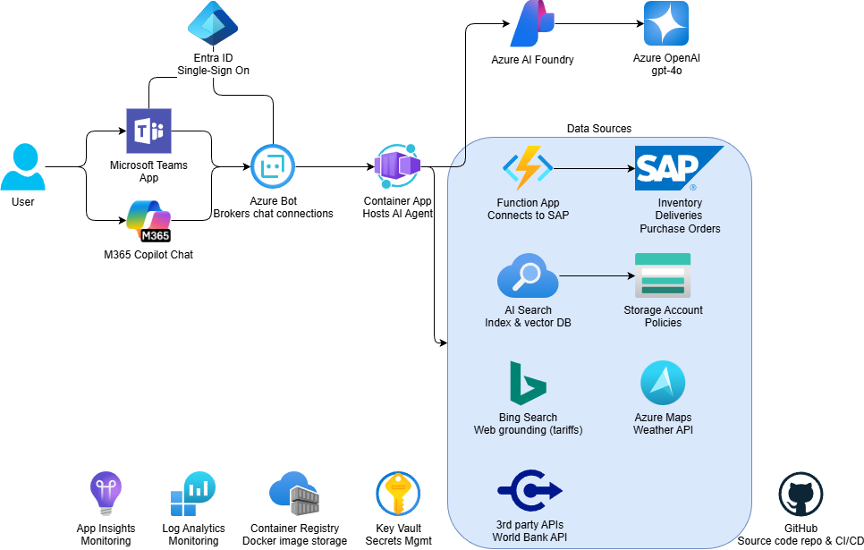

# mfg-sap-ai-agent

This repo is an example of a Microsoft 365 Copilot agent that can be used to interact with SAP systems. It is built using the Microsoft AI Agent framework and is designed to be deployed in Microsoft Teams. The agent can be used to perform various tasks such as querying SAP data, creating SAP transactions, and more.

## Architecture



## Prerequisites

- [Azure CLI](https://learn.microsoft.com/en-us/cli/azure/install-azure-cli?view=azure-cli-latest)
- [Azure Dev Tunnel](https://learn.microsoft.com/en-us/azure/developer/dev-tunnels/get-started?tabs=windows)
- [Visual Studio 2022](https://visualstudio.microsoft.com/vs/)
- [Microsoft Teams](https://www.microsoft.com/en-us/microsoft-teams/download-app)

## Deployment instructions

1.  Create [Entra ID app registration & service principal](https://learn.microsoft.com/en-us/azure/bot-service/bot-service-quickstart-registration?view=azure-bot-service-4.0&tabs=userassigned)

    1.  Copy the `Tenant ID` and `Application (client) ID` to Notepad.

    ### Authentication blade
    
    1.  Set `Web` Redirect URI to `https://token.botframework.com/.auth/web/redirect`

    1.  Set `Who can use this application or access this API` to `Accounts in any organizational directory (Any Microsoft Entra ID tenant - Multitenant)`

    ### Certificates & secrets blade

    1.  Create a Client Secret

    1.  Copy this secret to Notepad.

    ### API Permissions blade

    1.  Add the following `delegated` Microsoft Graph API permissions

        - Mail.Read
        - Mail.Send
        - openai
        - profile
        - User.Read
        - User.ReadBasic.All

    ### Expose an API blade

    1.  Add the `Application ID URI`. Take the default.

    ### Owners
    
    1.  Set the Owner.

1.  Deploy Azure infrastructure

    1.  Set the config values.

        - `tenant_id`
        - `client_id`
        - `client_secret`
        - `scopes` (only needed if you set different values from the default ones)

    1.  Enable Channels->Microsoft Teams

1.  Configure application settings

1.  Build M365 manifest

    1.  Navigate to [https://dev.teams.microsoft.com/](https://dev.teams.microsoft.com)

    1.  On the `Apps` blade, select `New app`

    1.  Enter a name for the app

    1.  **Change `Manifest version` to `Public developer preview (devPreview)`**

    ### Configure -> Basic Information blade

    1.  Copy the `App ID` to Notepad.

    1.  Enter a `Description`, `Developer`, `Website`, `Privacy policy`, `Terms of use`

    1.  Set the `Application (client) ID` to the `Entra ID Application (client) ID` created above.

    1.  Click `Save`

    ### Configure -> App features blade

    1.  Select `Bot`

    1.  Click `Create a new bot`

    1.  Select `Enter a bot ID` and enter the `Entra ID Application (client) ID` from the Azure Bot service.

    1.  Under `Select the scopes where people can use your bot`, select `Personal` and `Group Chat`.

    1.  Click `Save`

    ### Configure -> Single sign-on blade

    1.  Enter the `Application ID URI` from your Entra ID app registration in the following format

        ```
        api://tenant-id/app-id
        ```

    1.  Click `Save`

    ### Advanced -> Owners

    1.  Add owners for the app and set the role to `Administrator`

    ### Publish -> App validation blade

    1.  Click `New validation` or `Get Started`

    1.  Validate that the bot passes the tests.

    ### Publish

    1.  Click Publish

    1.  Select `Publish to your org`

    1.  Select `Publish to your org`.

    ### Approve publish

    1.  Navigate to [https://admin.microsoft.com/Adminportal](https://admin.microsoft.com/Adminportal)

    1.  Under the `Settings -> Integrated apps -> Requested apps` section, select the app you just published (with the status `Publish Pending`).

    1.  Click `Publish` to approve the app and click `Confirm`.

    ### Deploy app
    
    1.  Under `Available apps`, select the app you just published and click `Deploy app`. Click `Next.`

    1.  Under `Users`, select `Entire organization`. Click `Next`.

    1.  Under `Deployment`, select `Accept permissions`. Click `Next.`

    1.  Click `Finish deployment`.

    ### Interact with bot

    1.  Open [Microsoft Teams](https://teams.microsoft.com/v2/).

    1.  Select the `Apps` icon on the left side of the screen.

    1.  Select the `Built for your org` tab.

    1.  Select the app you just published.

    1.  Click `Add` to add the app to your Teams.

    1.  Click `Open` to open the app.

## How to test bot running locally

1.  Open the `app/api/Assistants.Hub.API.csproj` project in Visual Studio.

1.  Run the project. Note the *https* port number (e.g. `7041`).

1.  In a command window, run a [DevTunnel](https://learn.microsoft.com/en-us/azure/developer/dev-tunnels/get-started?tabs=windows)

    ```shell
    devtunnel host -a -p <port-number> --protocol https
    ```

1.  Copy the `Tunnel URL` (e.g. `https://abc123.devtunnels.ms`).

1.  Open a browser and navigate to the [Azure portal](https://portal.azure.com/).

1.  Navigate to the Azure Bot service.

1.  Under `Settings -> Configuration` blade, set the `Messaging endpoint` to the `Tunnel URL` with `/api/messages` appended to it.

    ```
    https://<tunnel-url>/api/messages
    ```

    **WARNING:** Changing the `Messaging endpoint` **will break any existing connections** from the Azure Bot service to a backend (such as the one hosted in Container Apps). You should stand up another Azure Bot service if you do not want to break existing users of the bot.

1.  Click `Save`.

1.  Open the `Test in Web Chat` blade to test.